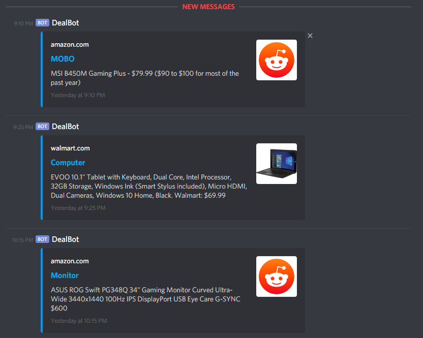

# Have u Reddit? 

A Discord Bot that allows users to subscribe to subreddits and receive a notification every time a new post is made. 

## Getting Started

To deploy this bot to your Discord servers, create a bot account as described in: https://discordapp.com/developers/docs/intro, and create text channels in your Discord server with names for each subreddit you wish to monitor (i.e. `buildapcsales`). 

Create a `.env` file and include `DISCORD_TOKEN` which can be generated on the Discord developer portal.

After this, modify `subreddits.json` to include only the subreddits you wish to monitor.
* name is the subreddit
* frequency is how many seconds the subreddit is checked
* removeFirstWord removes the first word of the title (used for removing some flairs due to subreddit guidelines)

Then, feel free to run it locally or deploy it anywhere! :) 
